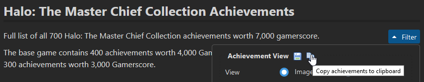

# Copy TrueGaming achievement list

Copies the achievements/trophies from the [True Achievements](https://www.trueachievements.com/), [TrueTrophies](https://www.truetrophies.com/), and [TrueSteamAchievements](https://truesteamachievements.com/) game page to clipboard as a table for further processing elsewhere.

To trigger the functionality, click the newly added **copy icon in the filter dropdown** of the game page.

The script parses the data for each achievement and puts it on the clipboard formatted as a **tab-separated table** with the following structure:

| DLC type     | DLC title               | Name                    | Description                                                      | Gamerscore |  TA | TA ratio | Unlocked | URL                                                                          |
| :----------- | :---------------------- | :---------------------- | :--------------------------------------------------------------- | ---------: | --: | -------: | :------: | :--------------------------------------------------------------------------- |
|              |                         | Life Story              | Complete the Master Chief Saga playlist.                         |         30 | 148 |     4.92 |    No    | https://www.trueachievements.com/a193100/life-story-achievement              |
| Add-on       | Halo Reach: Campaign    | New Ways to Save a Quid | Halo: Reach: Hear a familiar voice on New Alexandria.            |         10 |  21 |     2.13 |    No    | https://www.trueachievements.com/a288697/new-ways-to-save-a-quid-achievement |
| Title update | Halo Reach: Multiplayer | Negative, Ghostrider    | Halo: Reach: Get a Skullamanjaro in a matchmade Headhunter game. |         10 |  46 |     4.57 |    No    | https://www.trueachievements.com/a288678/negative-ghostrider-achievement     |

This makes it work well when pasted in a spreadsheet application, but keeps it useful for plain text processing as well.

## Release notes

### v1.0.1 (2021-05-23)

- Fixes parsing of DLC information after site redesign

### v1.0.0 (2020-12-27)

- Initial release
